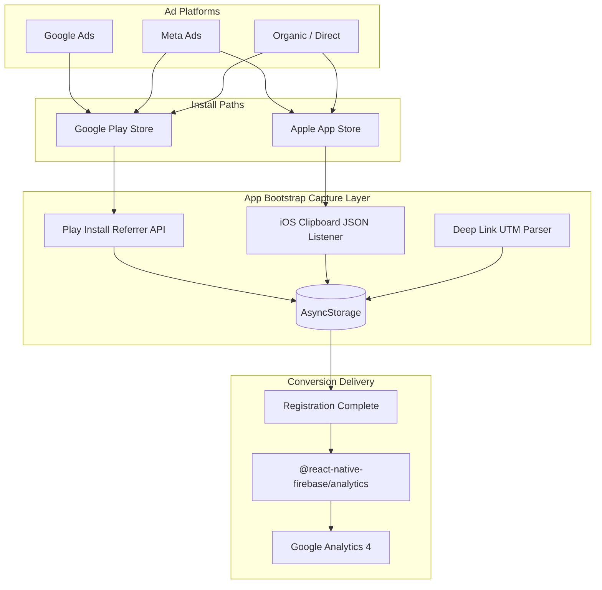
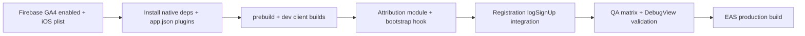

# Mobile Attribution Tracking — Technical Specification & Implementation Plan

**Project:** Jaaspire (`com.convoia.jaaspire`)  
**Platform:** Expo SDK 54 · React Native 0.81 · expo-dev-client (required)  
**Firebase project:** `jaaspire-be375` (Android config present; iOS config missing)  
**Target delivery:** GA4 via Firebase Analytics native SDK

---

## Current State Assessment

| Area                                           | Status                                                                                                                                                                       |
| ---------------------------------------------- | ---------------------------------------------------------------------------------------------------------------------------------------------------------------------------- |
| [`google-services.json`](google-services.json) | Present, linked in [`app.json`](app.json)                                                                                                                                    |
| `GoogleService-Info.plist`                     | **Missing** — required for iOS Firebase                                                                                                                                      |
| `@react-native-firebase/*`                     | **Not installed**                                                                                                                                                            |
| `react-native-play-install-referrer`           | **Not installed**                                                                                                                                                            |
| `expo-clipboard`                               | **Not installed**                                                                                                                                                            |
| `@react-native-async-storage/async-storage`    | Installed and used                                                                                                                                                           |
| `expo-dev-client`                              | Installed — native modules supported                                                                                                                                         |
| UTM API fields                                 | Defined in [`RegisterRequest`](src/services/api/api.types.ts) (`utm_source`, `utm_medium`, `utm_campaign`) but **not sent** from [`register.tsx`](<app/(auth)/register.tsx>) |
| Bootstrap hook point                           | [`app/_layout.tsx`](app/_layout.tsx) — `RootLayoutInner`                                                                                                                     |
| Registration completion                        | [`register.tsx`](<app/(auth)/register.tsx>) direct login **or** [`verify-2fa.tsx`](<app/(auth)/verify-2fa.tsx>) after OTP                                                    |

---

## 1. ARCHITECTURAL OVERVIEW

### 1.1 System Context

Attribution is a **first-launch, write-once** concern. The app captures campaign source at cold start, persists it locally, and emits it exactly once to GA4 when the user completes registration. Onboarding must never block on attribution failure.



### 1.2 Flow A — App Already Installed (Direct / Re-engagement)

User clicks an ad or marketing link while the app is installed. The OS opens the app via Universal Link (`https://jaaspire.com/...?utm_source=...`) or custom scheme (`jaaspire://...`).

| Step | Action                                                                                                              |
| ---- | ------------------------------------------------------------------------------------------------------------------- |
| 1    | OS resolves link → app foregrounded or cold-started                                                                 |
| 2    | `expo-linking` / existing [`useNotificationDeepLink`](src/hooks/use-notification-deep-link.ts) pattern receives URL |
| 3    | Attribution module parses query params: `utm_source`, `utm_medium`, `utm_campaign`, `gclid`, `fbclid`               |
| 4    | If `attribution_done !== 'true'`, persist normalized `ad_utm_source` and optional medium/campaign                   |
| 5    | Set `attribution_done = 'true'` (barrier — first successful capture wins)                                           |
| 6    | Existing deep-link router logic continues unchanged                                                                 |

**Priority rule:** Play Referrer / Clipboard runs only when `attribution_done` is unset. Deep-link UTM can **upgrade** stored values on first session if capture ran before link resolution (race-safe via single-writer AsyncStorage).

### 1.3 Flow B — App Not Installed (Deferred Deep Linking / Install Attribution)

User clicks ad → store listing → install → first open. No in-app URL is available at click time; platform-specific deferred signals are used.

| Platform     | Mechanism                                                                                                                       | Source signal                                                                                            |
| ------------ | ------------------------------------------------------------------------------------------------------------------------------- | -------------------------------------------------------------------------------------------------------- |
| **Android**  | [Play Install Referrer API](https://developer.android.com/google/play/installreferrer) via `react-native-play-install-referrer` | Referrer string from Play Store, e.g. `utm_source=google&utm_medium=cpc&utm_campaign=...` or `gclid=...` |
| **iOS**      | Secure clipboard read via `expo-clipboard`                                                                                      | JSON payload placed by ad landing page / MMP before App Store redirect                                   |
| **Fallback** | No signal within validity window                                                                                                | `ad_utm_source = 'organic'`                                                                              |

```mermermaid
sequenceDiagram
  participant User
  participant Ad as AdLandingPage
  participant Store as AppStore
  participant App as JaaspireApp
  participant Storage as AsyncStorage
  participant GA4 as FirebaseAnalytics

  User->>Ad: Click ad
  alt Android deferred
    Ad->>Store: Redirect with referrer params
    User->>Store: Install
    User->>App: First launch
    App->>App: PlayInstallReferrer.getInstallReferrer()
    App->>Storage: ad_utm_source, attribution_done
  else iOS deferred
    Ad->>Ad: Copy JSON to clipboard
    Ad->>Store: Redirect to App Store
    User->>Store: Install
    User->>App: First launch
    App->>App: Clipboard read + 30min validation
    App->>App: Safety clipboard wipe
    App->>Storage: ad_utm_source, attribution_done
  end
  User->>App: Complete registration
  App->>Storage: Read ad_utm_source
  App->>GA4: logSignUp with campaign_source
```

### 1.4 Tech Stack Components

| Component                              | Role in this system                                                                               |
| -------------------------------------- | ------------------------------------------------------------------------------------------------- |
| **Expo (React Native)**                | App shell; requires **development/production builds** (`expo run:*`, EAS Build) — **not Expo Go** |
| **expo-dev-client**                    | Already present; enables native Firebase + Referrer modules                                       |
| **AsyncStorage**                       | Durable first-party store for `ad_utm_source`, UTM dimensions, `attribution_done` barrier         |
| **@react-native-firebase/app**         | Native Firebase core; reads `google-services.json` / `GoogleService-Info.plist`                   |
| **@react-native-firebase/analytics**   | GA4 event delivery (`logSignUp`, custom params, DebugView)                                        |
| **react-native-play-install-referrer** | Android Play Store install referrer string                                                        |
| **expo-clipboard**                     | iOS deferred attribution JSON read + post-read wipe                                               |
| **expo-linking**                       | Already in project; supplements direct-open UTM capture                                           |
| **expo-build-properties**              | iOS `useFrameworks: static` + `forceStaticLinking` for RN Firebase on SDK 54                      |

---

## 2. NATIVE CONFIGURATIONS & PRE-REQUISITES

### 2.1 Firebase Console — Critical Prerequisite

**Before downloading native config files:**

1. Open [Firebase Console](https://console.firebase.google.com/) → project `jaaspire-be375`
2. **Project Settings → Integrations → Google Analytics** → ensure GA4 property is **linked and enabled**
3. **Analytics → Admin → Data Streams** → confirm iOS + Android streams exist for `com.convoia.jaaspire`
4. Register apps if missing:
   - Android: package `com.convoia.jaaspire` (already has [`google-services.json`](google-services.json))
   - iOS: bundle ID `com.convoia.jaaspire` → download **`GoogleService-Info.plist`** (currently **missing**)
5. Re-download config files **after** GA is toggled ON so Analytics SDK flags are embedded

> Without GA enabled at project creation time, Analytics collection may be disabled in the plist/json and DebugView will show no events.

### 2.2 Package Installation

```bash
npx expo install @react-native-firebase/app @react-native-firebase/analytics
npx expo install expo-build-properties expo-clipboard
npm install react-native-play-install-referrer
```

### 2.3 [`app.json`](app.json) Modifications

**Android permissions** — add Play Install Referrer broadcast permission alongside existing billing permission:

```json
"android": {
  "package": "com.convoia.jaaspire",
  "googleServicesFile": "./google-services.json",
  "permissions": [
    "com.android.vending.BILLING",
    "com.android.vending.INSTALL_REFERRER"
  ]
}
```

**iOS Google Services** — add plist reference:

```json
"ios": {
  "bundleIdentifier": "com.convoia.jaaspire",
  "googleServicesFile": "./GoogleService-Info.plist"
}
```

**Config plugins** — append to existing `plugins` array (keep all current plugins):

```json
"plugins": [
  "@react-native-firebase/app",
  [
    "@react-native-firebase/analytics",
    {
      "ios": {
        "googleAppMeasurementOnDeviceConversion": true
      }
    }
  ],
  [
    "expo-build-properties",
    {
      "ios": {
        "useFrameworks": "static",
        "forceStaticLinking": ["RNFBApp", "RNFBAnalytics"]
      }
    }
  ]
]
```

### 2.4 Native Regeneration

After config changes:

```bash
npx expo prebuild --clean
npx expo run:android --device
npx expo run:ios --device
```

For EAS: trigger new **development** and **production** builds; OTA updates alone cannot add native Firebase modules.

### 2.5 Ad Platform Configuration (External)

| Platform       | Requirement                                                                                                                          |
| -------------- | ------------------------------------------------------------------------------------------------------------------------------------ |
| **Google Ads** | App campaign linked to Play package; final URL / tracking template includes `utm_source=google` (or parse `gclid` → map to `google`) |
| **Meta Ads**   | iOS: landing page writes clipboard JSON (see §3.3); Android: use Play Store URL with referrer params or Meta SDK (optional future)   |
| **Organic**    | No params → app defaults to `organic`                                                                                                |

---

## 3. DATA CAPTURE IMPLEMENTATION PLAN (APP BOOTSTRAP)

### 3.1 Module Structure (New Files)

```
src/features/attribution/
  attribution.constants.ts   # AsyncStorage keys, 30-min TTL, source normalization map
  attribution.storage.ts     # get/set attribution_done, ad_utm_source, utm_medium, utm_campaign
  attribution.android.ts     # Play Install Referrer capture
  attribution.ios.ts         # Clipboard JSON capture + wipe
  attribution.parser.ts      # URL decode, query parse, gclid/fbclid → source mapping
  attribution.service.ts     # captureAttributionOnce() orchestrator
  attribution.hooks.ts       # useAttributionCapture()
  attribution.analytics.ts   # logRegistrationAttribution() → Firebase logSignUp
```

### 3.2 Root Bootstrap Integration

Wire in [`app/_layout.tsx`](app/_layout.tsx) inside `RootLayoutInner`, **before** auth restore completes (attribution is device-level, not session-level):

```typescript
// app/_layout.tsx
import { useAttributionCapture } from "@/src/features/attribution/attribution.hooks";

function RootLayoutInner() {
  useAttributionCapture(); // fire-and-forget on mount
  // ... existing hooks
}
```

**`useAttributionCapture` contract:**

- Runs once per app process via `useRef` guard + AsyncStorage `attribution_done`
- Wrapped entirely in `try/catch`; failures log in `__DEV__` only
- Never awaits blocking UI; runs in `useEffect` with `void captureAttributionOnce()`

### 3.3 Android Execution Flow

```typescript
// attribution.android.ts (pseudocode blueprint)
import PlayInstallReferrer from "react-native-play-install-referrer";

export async function captureAndroidReferrer(): Promise<string | null> {
  const info = await PlayInstallReferrer.getInstallReferrer();
  const raw = info?.installReferrer ?? "";
  if (!raw) return null;

  const decoded = decodeURIComponent(raw.replace(/\+/g, " "));
  const params = new URLSearchParams(decoded);

  // Priority: explicit utm_source → infer from gclid/fbclid → null
  const utmSource = params.get("utm_source");
  if (utmSource) return normalizeSource(utmSource);

  if (params.has("gclid")) return "google";
  if (params.has("fbclid")) return "meta";

  return null;
}
```

| Step | Detail                                                                                         |
| ---- | ---------------------------------------------------------------------------------------------- |
| 1    | Check `attribution_done` — if `'true'`, return early                                           |
| 2    | Call `getInstallReferrer()` inside try/catch (API unavailable on emulators without Play Store) |
| 3    | URL-decode referrer string (`decodeURIComponent`, handle `+` as space)                         |
| 4    | Parse as query string; extract `utm_source`                                                    |
| 5    | Map `gclid` → `google`, `fbclid` → `meta` if `utm_source` absent                               |
| 6    | Persist `ad_utm_source` (or `'organic'` if null) + optional medium/campaign                    |
| 7    | Set `attribution_done = 'true'`                                                                |

### 3.4 iOS Execution Flow (Clipboard)

Expected clipboard JSON schema (written by ad landing page / web bridge):

```json
{
  "utm_source": "meta",
  "utm_medium": "cpc",
  "utm_campaign": "creator_launch_q2",
  "timestamp": 1718659200000
}
```

```typescript
// attribution.ios.ts (pseudocode blueprint)
import * as Clipboard from "expo-clipboard";

const CLIPBOARD_TTL_MS = 30 * 60 * 1000; // 30 minutes

export async function captureIosClipboardAttribution(): Promise<string | null> {
  const raw = await Clipboard.getStringAsync();
  if (!raw?.trim()) return null;

  let payload: unknown;
  try {
    payload = JSON.parse(raw.trim());
  } catch {
    return null; // not our JSON — do not wipe user clipboard
  }

  if (!payload || typeof payload !== "object") return null;
  const { utm_source, timestamp } = payload as Record<string, unknown>;

  if (typeof utm_source !== "string" || !utm_source.trim()) return null;
  if (typeof timestamp !== "number" || !Number.isFinite(timestamp)) return null;

  const age = Date.now() - timestamp;
  if (age < 0 || age > CLIPBOARD_TTL_MS) return null; // expired or clock skew

  // Safety wipe ONLY after validated attribution JSON consumed
  await Clipboard.setStringAsync("");

  return normalizeSource(utm_source);
}
```

| Step | Detail                                                                                            |
| ---- | ------------------------------------------------------------------------------------------------- |
| 1    | Check `attribution_done` — if set, skip                                                           |
| 2    | Read clipboard string (requires no extra iOS permission for read on first launch)                 |
| 3    | Attempt `JSON.parse`; non-JSON → exit silently (**do not wipe**)                                  |
| 4    | Validate required fields: `utm_source` (string), `timestamp` (number)                             |
| 5    | Enforce **30-minute window**: `Date.now() - timestamp <= 1_800_000`                               |
| 6    | On success: persist UTM fields, set `attribution_done`, **wipe clipboard** (`setStringAsync("")`) |
| 7    | On validation failure: no wipe, fall through to `'organic'` at orchestrator level                 |

### 3.5 Source Normalization

```typescript
// attribution.constants.ts
export const SOURCE_ALIASES: Record<string, string> = {
  google: "google",
  "google ads": "google",
  gclid: "google",
  facebook: "meta",
  meta: "meta",
  instagram: "meta",
  fb: "meta",
  organic: "organic",
};

export function normalizeSource(raw: string): string {
  const key = raw.trim().toLowerCase();
  return SOURCE_ALIASES[key] ?? key;
}
```

### 3.6 AsyncStorage Schema

| Key                       | Type               | Purpose                                                                   | Written when                                           | Read when              |
| ------------------------- | ------------------ | ------------------------------------------------------------------------- | ------------------------------------------------------ | ---------------------- |
| `attribution_done`        | `'true' \| absent` | **System execution barrier** — prevents duplicate capture across launches | First successful capture (or explicit organic default) | Every bootstrap        |
| `ad_utm_source`           | `string`           | Primary GA4 `campaign_source` dimension                                   | Capture success or organic fallback                    | Registration complete  |
| `ad_utm_medium`           | `string?`          | Optional secondary dimension                                              | Capture if present                                     | Registration / backend |
| `ad_utm_campaign`         | `string?`          | Optional campaign name                                                    | Capture if present                                     | Registration / backend |
| `attribution_captured_at` | `ISO8601 string`   | Debug/audit timestamp                                                     | Capture time                                           | QA only                |

**Orchestrator logic (`captureAttributionOnce`):**

```typescript
export async function captureAttributionOnce(): Promise<void> {
  try {
    if ((await getAttributionDone()) === "true") return;

    let source: string | null = null;
    if (Platform.OS === "android") {
      source = await captureAndroidReferrer();
    } else if (Platform.OS === "ios") {
      source = await captureIosClipboardAttribution();
    }

    await persistAttribution({
      utm_source: source ?? "organic",
      // medium/campaign from parsed params when available
    });
    await setAttributionDone("true");
  } catch (error) {
    if (__DEV__) console.warn("[attribution] capture failed", error);
    // Still set barrier + organic to avoid retry storms
    await persistAttribution({ utm_source: "organic" }).catch(() => {});
    await setAttributionDone("true").catch(() => {});
  }
}
```

> **Design decision:** Setting `attribution_done` even on failure prevents infinite retry loops and guarantees registration always has a readable source (`organic`).

---

## 4. GA4 EVENT DELIVERY MATRIX

### 4.1 Event Specification

| GA4 Event | Firebase API                                   | Trigger                                                              | Parameters                                                        |
| --------- | ---------------------------------------------- | -------------------------------------------------------------------- | ----------------------------------------------------------------- |
| `sign_up` | `analytics().logSignUp({ method, ...custom })` | User registration completes (account created + session token issued) | `method`: `'email'` · custom: `campaign_source` ← `ad_utm_source` |

Firebase maps `logSignUp` to GA4 recommended event **`sign_up`**. Custom params appear in GA4 **Event parameters** (register `campaign_source` as custom dimension in GA4 Admin for reporting).

### 4.2 Registration Complete Trigger Points

Registration completes in **two** code paths today — both must call the same tracker:

| Path                | File                                                   | Trigger                                           |
| ------------------- | ------------------------------------------------------ | ------------------------------------------------- |
| Direct registration | [`register.tsx`](<app/(auth)/register.tsx>) L125-127   | `"token" in data.data` → `authStore.login(token)` |
| 2FA registration    | [`verify-2fa.tsx`](<app/(auth)/verify-2fa.tsx>) L64-66 | OTP success → `authStore.login(token)`            |

**Recommended approach:** Centralize in [`auth.hooks.ts`](src/features/auth/auth.hooks.ts):

```typescript
// attribution.analytics.ts
import analytics from "@react-native-firebase/analytics";
import { getAdUtmSource } from "./attribution.storage";

export async function logRegistrationAttribution(): Promise<void> {
  try {
    const campaign_source = (await getAdUtmSource()) ?? "organic";

    await analytics().logSignUp({
      method: "email",
      campaign_source, // custom event parameter
    });
  } catch (error) {
    if (__DEV__) console.warn("[attribution] logSignUp failed", error);
  }
}

// auth.hooks.ts — extend login()
const login = useCallback(
  async (token: string, options?: { isRegistration?: boolean }) => {
    await tokenStorage.save(token);
    setToken(token);
    if (options?.isRegistration) {
      void logRegistrationAttribution();
    }
    void runPostLoginSetup();
  },
  [setToken],
);
```

Update call sites:

```typescript
// register.tsx onSuccess
authStore.login(data.data.token, { isRegistration: true });

// verify-2fa.tsx onSuccess
void authStore.login(r.data.token, { isRegistration: true });
```

> **Important:** Do **not** fire `logSignUp` on normal login — only `{ isRegistration: true }`.

### 4.3 AsyncStorage Read with Organic Fallback

```typescript
// attribution.storage.ts
const DEFAULT_SOURCE = "organic";

export async function getAdUtmSource(): Promise<string> {
  try {
    const value = await AsyncStorage.getItem("ad_utm_source");
    if (typeof value === "string" && value.trim().length > 0) {
      return value.trim();
    }
  } catch {
    /* fall through */
  }
  return DEFAULT_SOURCE;
}
```

### 4.4 Optional Backend Attribution Sync

[`RegisterRequest`](src/services/api/api.types.ts) already accepts UTM fields. Extend registration payload:

```typescript
const utm = await getStoredUtmParams();
register.mutate({
  ...formData,
  signup_source: Platform.OS === "android" ? "android" : "ios",
  utm_source: utm.source,
  utm_medium: utm.medium,
  utm_campaign: utm.campaign,
});
```

This gives server-side analytics redundancy independent of Firebase.

### 4.5 GA4 Admin Setup (Post-Implementation)

1. GA4 → **Admin → Custom definitions → Create custom dimension**
   - Scope: Event
   - Parameter: `campaign_source`
2. Link Firebase project to GA4 property (should already exist if §2.1 done)
3. Mark `sign_up` as **Key event** (conversion) if used for Google Ads import

---

## 5. QUALITY ASSURANCE, FAULT TOLERANCE & TESTING MATRIX

### 5.1 Build Environment Requirements

| Requirement                                     | Reason                                              |
| ----------------------------------------------- | --------------------------------------------------- |
| Use `npx expo run:android` / `npx expo run:ios` | Native Firebase + Referrer not in Expo Go           |
| Physical device or Play-enabled emulator        | Install Referrer unavailable on plain AVD           |
| Firebase DebugView enabled                      | Real-time event validation                          |
| Uninstall app between deferred tests            | Referrer/clipboard only meaningful on first install |

### 5.2 Verification Checklist

| #   | Test case                 | Platform | Setup                                                                      | Expected AsyncStorage                            | Expected GA4 (DebugView)                             |
| --- | ------------------------- | -------- | -------------------------------------------------------------------------- | ------------------------------------------------ | ---------------------------------------------------- |
| 1   | Organic first install     | Both     | Fresh install, no ad click                                                 | `ad_utm_source=organic`, `attribution_done=true` | `sign_up` with `campaign_source=organic` on register |
| 2   | Google Ads deferred       | Android  | Play Store install with referrer string `utm_source=google&utm_medium=cpc` | `ad_utm_source=google`                           | `sign_up` → `campaign_source=google`                 |
| 3   | Google gclid only         | Android  | Referrer `gclid=abc123`                                                    | `ad_utm_source=google`                           | same                                                 |
| 4   | Meta deferred             | iOS      | Paste valid JSON (<30 min) to clipboard before first launch                | `ad_utm_source=meta`, clipboard cleared          | `sign_up` → `campaign_source=meta`                   |
| 5   | Expired iOS clipboard     | iOS      | JSON with `timestamp` > 30 min ago                                         | `ad_utm_source=organic`, clipboard untouched     | `campaign_source=organic`                            |
| 6   | Invalid iOS clipboard     | iOS      | Plain text / non-JSON on clipboard                                         | `organic`, clipboard untouched                   | `campaign_source=organic`                            |
| 7   | Second launch idempotency | Both     | Relaunch after capture                                                     | No re-read; keys unchanged                       | N/A                                                  |
| 8   | Registration via 2FA      | Both     | Register → verify OTP → login                                              | N/A                                              | Single `sign_up` event only                          |
| 9   | Normal login              | Both     | Existing user login                                                        | N/A                                              | **No** `sign_up` event                               |
| 10  | Deep link UTM (installed) | Both     | Open `jaaspire://signup?utm_source=google` before register                 | `ad_utm_source=google`                           | reflected on `sign_up`                               |

### 5.3 Edge Cases & Fault Tolerance

| Edge case                                   | Handling                                       | User impact                     |
| ------------------------------------------- | ---------------------------------------------- | ------------------------------- |
| Clipboard read throws (iOS privacy / empty) | catch → `organic`, set `attribution_done`      | None                            |
| Clipboard has user content (non-JSON)       | Skip wipe, store `organic`                     | None — user clipboard preserved |
| Referrer API timeout / null (emulator)      | catch → `organic`                              | None                            |
| Missing Play Store ( sideload APK )         | Referrer unavailable → `organic`               | None                            |
| Network offline at `logSignUp`              | Firebase SDK queues locally; syncs when online | None                            |
| Firebase not initialized (misconfig build)  | try/catch around analytics call                | None — registration succeeds    |
| Duplicate bootstrap calls                   | `attribution_done` barrier + in-memory ref     | None                            |
| Clock skew on iOS timestamp                 | Reject if `age < 0`                            | Falls back to `organic`         |

**Golden rule:** Every attribution code path is wrapped in `try/catch`. **Never throw into React render or registration mutation handlers.**

### 5.4 Firebase DebugView — Step-by-Step

**Android:**

```bash
adb shell setprop debug.firebase.analytics.app com.convoia.jaaspire
# Disable when done:
adb shell setprop debug.firebase.analytics.app .none.
```

**iOS (Simulator):**

```bash
xcrun simctl spawn booted log config --mode "level:debug" --subsystem com.google.firebase.analytics
```

Or Xcode → Edit Scheme → Run → Arguments → `-FIRAnalyticsDebugEnabled`

**Validation steps:**

1. Enable DebugView (steps above)
2. Firebase Console → **Analytics → DebugView**
3. Launch dev build → confirm device appears in device list
4. Complete registration flow
5. Verify event **`sign_up`** with parameters:
   - `method = email`
   - `campaign_source = google | meta | organic`
6. Disable debug mode before release testing

### 5.5 Dev-Only Diagnostics (Optional)

Gate behind `__DEV__`:

```typescript
if (__DEV__) {
  console.log("[attribution]", {
    done: await getAttributionDone(),
    source: await getAdUtmSource(),
  });
}
```

Remove or silence before production if log noise is a concern.

---

## Implementation Sequence



### File Touch Summary

| File                                                                 | Change                                                     |
| -------------------------------------------------------------------- | ---------------------------------------------------------- |
| [`app.json`](app.json)                                               | Permissions, iOS plist, Firebase plugins, build-properties |
| [`package.json`](package.json)                                       | New dependencies                                           |
| `GoogleService-Info.plist`                                           | **Add** (from Firebase Console)                            |
| [`app/_layout.tsx`](app/_layout.tsx)                                 | `useAttributionCapture()`                                  |
| [`src/features/auth/auth.hooks.ts`](src/features/auth/auth.hooks.ts) | `login(token, { isRegistration })`                         |
| [`app/(auth)/register.tsx`](<app/(auth)/register.tsx>)               | Pass UTM to API + registration flag                        |
| [`app/(auth)/verify-2fa.tsx`](<app/(auth)/verify-2fa.tsx>)           | Registration flag on login                                 |
| `src/features/attribution/*`                                         | **New module** (7 files)                                   |

---

## Risks & Mitigations

| Risk                                                                  | Mitigation                                                                                                        |
| --------------------------------------------------------------------- | ----------------------------------------------------------------------------------------------------------------- |
| iOS clipboard attribution is fragile / App Store policy sensitivity   | Validate JSON strictly; wipe only confirmed attribution payloads; document dependency on landing-page integration |
| Meta deferred deep linking limited on iOS 14.5+ SKAdNetwork campaigns | Clipboard flow is complementary; consider Meta SDK / AEM API as Phase 2                                           |
| Missing `GoogleService-Info.plist` blocks iOS Firebase                | Download before iOS build                                                                                         |
| `logSignUp` custom params require GA4 custom dimension registration   | Complete GA4 Admin setup in §4.5                                                                                  |
| Expo Go used accidentally                                             | Document in README; CI uses EAS/dev builds only                                                                   |
