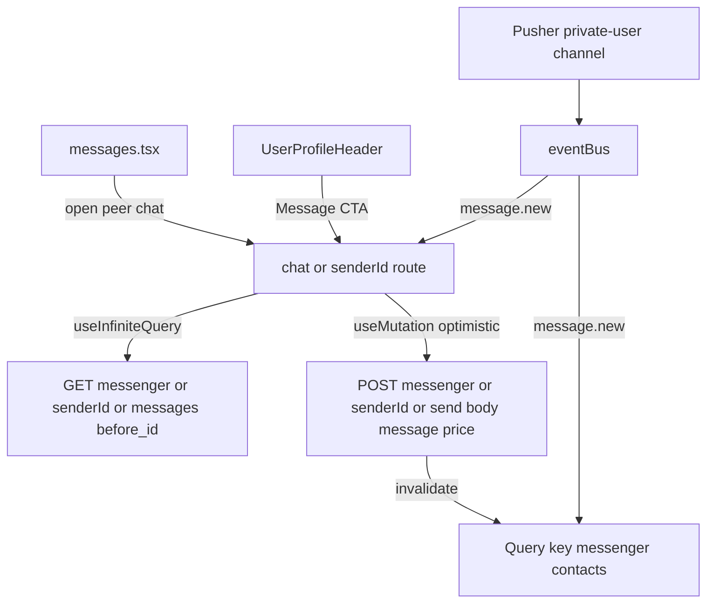

# DM Chat Screen Implementation Plan

## Goal

Build a production-grade direct message screen using `react-native-gifted-chat`, wired to:
- `GET messenger/{senderId}/messages?before_id=<oldestMessageId>`
- `POST messenger/{senderId}/send` with body `{ "message": string, "price": number }` (for now `price = 0`)
- existing realtime `message.new` events from [pusher.ts](/Users/flickios/Desktop/jaaspire/src/lib/pusher.ts)

Also ensure messenger contacts refresh after send/new message so the latest preview appears on the contacts screen.

## API Contract (from discussion)

### Conversation fetch
- **Method:** `GET`
- **Endpoint:** `messenger/{senderId}/messages`
- **Pagination:** `before_id=<oldestMessageId>`
- **Response shape:** `ApiResponse` with `data.messages[]` and `data.pagination` (`hasMore`, `oldestMessageId`)

### Send message
- **Method:** `POST`
- **Endpoint:** `messenger/{senderId}/send`
- **Body:**
  - `message: string`
  - `price: number` (static `0` for now)
- **Behavior required:** optimistic update in chat UI

### Realtime behavior
- On `message.new`:
  - update/invalidate the active conversation query
  - invalidate `["messenger", "contacts"]`
- On successful send:
  - invalidate `["messenger", "contacts"]`

## Files to Add / Update

- **Add:** [app/(app)/chat/[senderId].tsx](/Users/flickios/Desktop/jaaspire/app/(app)/chat/[senderId].tsx)
- **Update:** [app/(app)/_layout.tsx](/Users/flickios/Desktop/jaaspire/app/(app)/_layout.tsx) (register chat screen in stack)
- **Update:** [app/(app)/messages.tsx](/Users/flickios/Desktop/jaaspire/app/(app)/messages.tsx) (row press navigation into chat)
- **Update:** [src/components/profile/UserProfileHeader.tsx](/Users/flickios/Desktop/jaaspire/src/components/profile/UserProfileHeader.tsx) (Message CTA to target chat directly)
- **Update:** [src/services/api/api.types.ts](/Users/flickios/Desktop/jaaspire/src/services/api/api.types.ts) (message + pagination DTOs)
- **Update:** [src/features/messenger/messenger.hooks.ts](/Users/flickios/Desktop/jaaspire/src/features/messenger/messenger.hooks.ts) (thread query + send mutation)
- **Update:** [src/lib/pusher.ts](/Users/flickios/Desktop/jaaspire/src/lib/pusher.ts) (connect `useChatRealtime` to query invalidation/update hooks)

## Detailed Implementation Plan

### 1) Type system and API integration

Add message/thread DTOs in [api.types.ts](/Users/flickios/Desktop/jaaspire/src/services/api/api.types.ts):
- `MessengerUser`
- `MessengerMessage`
- `MessengerThreadPagination`
- `MessengerMessagesResponse`
- `SendMessengerMessageRequest`
- `SendMessengerMessageResponse` (if backend returns message/ack wrapper)

Add hooks in [messenger.hooks.ts](/Users/flickios/Desktop/jaaspire/src/features/messenger/messenger.hooks.ts):
- `useGetMessengerMessages(senderId: number, beforeId?: number)`
- `useInfiniteMessengerMessages(senderId: number)` (recommended)
  - `getNextPageParam` -> `lastPage.data.pagination.hasMore ? lastPage.data.pagination.oldestMessageId : undefined`
  - query key: `["messenger", "messages", String(senderId)]`
- `useSendMessengerMessage(senderId: number)`
  - POST `messenger/${senderId}/send`
  - optimistic insert into query cache
  - rollback on failure
  - invalidate `["messenger", "contacts"]` on settle/success

### 2) Route and navigation

Create [app/(app)/chat/[senderId].tsx](/Users/flickios/Desktop/jaaspire/app/(app)/chat/[senderId].tsx):
- route param: `senderId`
- optional params for header UX: `name`, `username`, `avatar`
- screen responsibilities:
  - map API messages to GiftedChat messages
  - load older pages when scrolling up
  - send new text with optimistic behavior
  - subscribe to realtime updates for this conversation

Register in [app/(app)/_layout.tsx](/Users/flickios/Desktop/jaaspire/app/(app)/_layout.tsx):
- `Stack.Screen name="chat/[senderId]"`
- set header title with peer display name fallback
- minimal back behavior consistent with app

Wire inbox row press in [messages.tsx](/Users/flickios/Desktop/jaaspire/app/(app)/messages.tsx):
- use `getMessengerPeer(item)` id as `senderId`
- navigate with `router.push({ pathname: "/chat/[senderId]", params: { senderId, name, avatar, username } })`

Wire profile Message button in [UserProfileHeader.tsx](/Users/flickios/Desktop/jaaspire/src/components/profile/UserProfileHeader.tsx):
- navigate directly to `chat/[senderId]` using viewed profile user id
- keep existing visibility/access rules untouched

### 3) GiftedChat integration details

Install package (implementation phase): `react-native-gifted-chat`.

Map backend message -> GiftedChat message:
- `_id` -> `id`
- `text` -> `message`
- `createdAt` -> `created_at`
- `user._id` -> `sender_id`
- `user.name`/`user.avatar` -> sender profile fields

Because GiftedChat is bottom-anchored by default, chat starts from the bottom and older messages load as user scrolls up (iMessage/Instagram behavior).

### 4) Optimistic send strategy

On send:
1. Create temporary local message id (e.g. `temp-${Date.now()}`)
2. Immediately prepend/append into GiftedChat data source (based on mapping strategy)
3. Fire mutation to `POST messenger/{senderId}/send` with:
   - `message: <typed text>`
   - `price: 0`
4. On success:
   - replace temp message with server message or refetch thread page(s)
5. On error:
   - remove temp message
   - show inline error/toast
6. Always invalidate `["messenger", "contacts"]`

### 5) Realtime + query cache behavior

Use existing event bus flow in [pusher.ts](/Users/flickios/Desktop/jaaspire/src/lib/pusher.ts):
- subscribe in chat screen via `useChatRealtime(chatId)`
- on `message.new` for active chat:
  - patch/invalidate thread query key `["messenger", "messages", String(senderId)]`
  - invalidate contacts `["messenger", "contacts"]`

If broadcast payload is not guaranteed to include enough fields to render full GiftedChat row, prefer invalidating the thread query rather than partial risky merge.

### 6) Static “Set Price” button (no flow yet)

Add a button in composer area:
- label: `Set price`
- current behavior: no navigation flow, no modal
- tap behavior for now:
  - keep internal state/static constant `price = 0`
  - optional temporary toast/info text (“Price flow coming soon”)
- send mutation always includes `price: 0`

This keeps UI affordance visible while backend contract remains stable.

## Data Flow Diagram

## Testing and Validation Plan

### Functional checks
- Open chat from contacts list -> loads conversation
- Open chat from profile Message CTA -> lands in same thread
- Initial viewport anchored at latest messages (bottom)
- Scroll upward triggers older page fetch via `before_id`
- Send message appears instantly (optimistic)
- Failure path removes optimistic message and surfaces error
- Receiving `message.new` while in chat refreshes thread
- Contacts list latest message updates after send/receive

### Regression checks
- Existing `/messages` screen pull-to-refresh still works
- No crash when avatar/name missing in route params
- Chat works in both dark/light themes
- No duplicate messages after optimistic + realtime + refetch

### Non-functional checks
- Smooth list performance with long threads
- Correct key extraction and stable rendering in GiftedChat
- Query invalidation limited to messenger keys

## Rollout Steps

1. Add types and hooks
2. Add chat route screen
3. Wire inbox/profile navigation
4. Add optimistic send + static Set price button
5. Connect realtime query invalidation
6. Manual QA with two accounts

## Suggestions for Later Improvements

- Add full paid-message flow (custom price picker, validation, locked/open states)
- Add read receipts using `message.read` and server read endpoint if available
- Add message status chips (`sending`, `sent`, `failed`, `retry`)
- Add attachment support (image/video/file) and upload progress
- Add typing indicators and presence
- Add local persistence/caching for offline reads and queued sends
- Add message grouping/date separators and richer timestamps
- Add dedupe strategy across optimistic, realtime, and pagination merges
- Add analytics instrumentation (send success rate, latency, failure reasons)
- Add e2e tests for realtime and optimistic rollback behavior

## Assumptions

- `senderId` in route and API path identifies the peer/conversation target from contacts.
- `message.new` events are delivered on the already subscribed user channel.
- Backend accepts `price` in send payload even when zero.

## Open Question to Confirm Before Build

- Is API path param `senderId` actually the **peer user id/contact id** for the active DM thread?  
  (Naming suggests current sender, but endpoint behavior suggests conversation target.)
