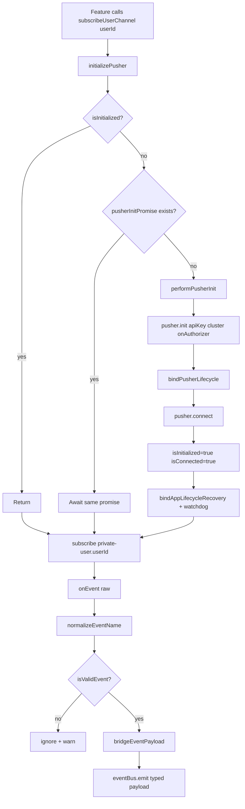
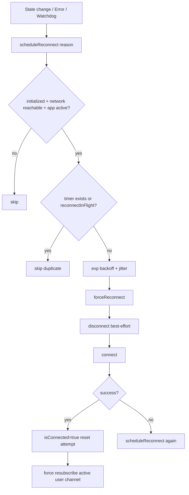
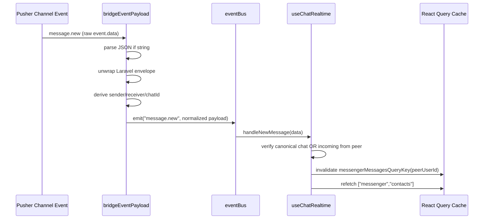

# `src/lib/pusher.ts` Deep Dive

This document explains `src/lib/pusher.ts` exactly as it is implemented today: its compile-time types, runtime flow, reconnection strategy, event normalization/bridging, and React hooks.

---

## 1) What this file is responsible for

`src/lib/pusher.ts` is a **realtime integration layer** that sits between:

- the Pusher React Native SDK (`@pusher/pusher-websocket-react-native`)
- your API auth endpoint (`/broadcasting/auth`)
- app lifecycle + network state (`AppState`, `NetInfo`)
- React Query cache updates
- app features (messenger + notifications)

It does four core jobs:

1. Initializes and keeps a single Pusher connection healthy.
2. Subscribes to the active user channel (`private-user.<id>`).
3. Normalizes incoming event names and payloads to app-safe TypeScript shapes.
4. Re-emits those events through an internal typed `EventBus`, which hooks consume.

---

## 2) Compile-time architecture (TypeScript design)

## 2.1 Event constants and union type

- `EventTypes` is an `as const` object.
- `EventType` is derived from values of `EventTypes`.
- This gives a literal union like `"message.new" | "message.read" | ...`.

## 2.2 `EventPayloadMap` is the central contract

`EventPayloadMap` maps each event name to its payload shape. Example:

- `"message.new"` -> `{ id; chatId; text; senderId; createdAt }`
- `"notification.new"` -> notification payload shape

This allows generic typing everywhere else.

## 2.3 Type-safe event bus

- `Callback<K>` takes `EventPayloadMap[K]`.
- `EventBus.on/off/emit` are generic over `K extends keyof EventPayloadMap`.

Result:

- if code subscribes to `"message.new"`, callback receives exactly that payload type.
- compile-time mismatch is prevented without runtime type-switching in consumer code.

---

## 3) Runtime state model (module-level singletons)

This file is effectively a singleton service (module scope state):

- Pusher state:
  - `isInitialized`, `isConnecting`, `isConnected`
  - `pusherInitPromise` (deduplicates concurrent init calls)
- Lifecycle state:
  - `lifecycleBound`, `pusherLifecycleBound`
  - `appStateSubscription`, `netInfoUnsubscribe`
- Recovery/reconnect state:
  - `reconnectTimer`, `watchdogInterval`
  - `reconnectInFlight`, `reconnectAttempt`
  - `isNetworkReachable`, `currentAppState`, `lastActivityAt`
- Channel/user state:
  - `activeUserId`, `activeChannelName`, `channel`

This is why multiple components can call hooks without creating multiple Pusher clients.

---

## 4) End-to-end flow diagrams

## 4.1 Connection and subscription flow

## 4.2 Recovery + reconnect flow

## 4.3 Chat event processing flow

---

## 5) Function-by-function explanation

## 5.1 Logging helpers

- `pusherDebug(...args)`
  - logs only in `__DEV__`.
- `pusherWarn(...args)`
  - warns only in `__DEV__`.
- `pusherError(message, ...args)`
  - always logs error.

Purpose: keep production less noisy while preserving hard error reporting.

## 5.2 Activity + reconnect helpers

- `markRealtimeActivity(source)`
  - updates `lastActivityAt`; used by watchdog staleness logic.
- `normalizeConnectionState(state)`
  - defensive lowercase + trim.
- `clearReconnectTimer()`
  - clears pending reconnect timeout if any.

## 5.3 `forceReconnect(reason)`

Behavior:

1. Guard with `reconnectInFlight` to avoid concurrent reconnects.
2. Clear scheduled timer.
3. Best-effort `disconnect()`.
4. Wait `300ms`.
5. `connect()`.
6. On success:
   - mark connected
   - reset attempts
   - force resubscribe active user channel if available
7. On failure:
   - mark disconnected
   - schedule backoff reconnect

Why this matters: it provides deterministic "hard reset" recovery.

## 5.4 `scheduleReconnect(reason)`

Key logic:

- only schedules when:
  - initialized,
  - network reachable,
  - app state is `"active"`.
- ignores if timer already exists or reconnect is running.
- delay = exponential backoff (`1s * 2^attempt`, capped `30s`) + random jitter up to `499ms`.
- timer triggers `forceReconnect("scheduled:<reason>")`.

## 5.5 Watchdog

- `startRealtimeWatchdog()`
  - every `30s`, checks stale conditions.
  - if active user + active app + network reachable and connection looks stale (`!isConnected` or idle >= 2 min), schedule reconnect.
- `stopRealtimeWatchdog()`
  - clears interval.

This catches "quietly dead" connections.

## 5.6 Initialization

- `performPusherInit()`
  - calls `pusher.init(...)` with:
    - `apiKey`, `cluster`
    - `onAuthorizer(channelName, socketId)` -> POST `/broadcasting/auth`
  - binds pusher lifecycle handlers
  - connects
  - marks initialized/connected
  - binds app/network lifecycle recovery

- `initializePusher()`
  - public guard wrapper.
  - reuses `pusherInitPromise` so concurrent callers await one in-flight init.

Compile/runtime implication: prevents race where multiple components call init simultaneously and create inconsistent states.

## 5.7 `subscribeUserChannel(userId, options?)`

Main entry point for user-level realtime subscription.

Flow:

1. set `activeUserId`, compute `private-user.<id>`.
2. ensure pusher initialized.
3. no-op if already on same channel (unless forced).
4. unsubscribe old channel if switching users.
5. subscribe new channel with:
   - `onSubscriptionError`
   - `onEvent` handler:
     - mark activity
     - normalize event name
     - validate event type
     - bridge payload into typed shape
     - emit through `eventBus`

Return value: channel object (or `null` when init fails).

## 5.8 Lifecycle bindings

- `bindPusherLifecycle()`
  - binds once.
  - if SDK supports it:
    - `onConnectionStateChange`: updates `isConnected`, resets backoff on connected, schedules reconnect on disconnected/unavailable.
    - `onError`: logs + schedules reconnect.

- `bindAppLifecycleRecovery()`
  - binds once.
  - AppState active -> `recoverRealtime("app_active")`
  - NetInfo restored -> `recoverRealtime("network_restored")`
  - starts watchdog

- `recoverRealtime(reason)`
  - if not initialized -> initialize
  - else if disconnected -> forceReconnect
  - if active user exists -> force resubscribe their channel

- `teardownPusherLifecycle()`
  - removes subscriptions/timers and resets lifecycle/reconnect flags.

## 5.9 Event normalization + payload bridge

- `isValidEvent(event)`
  - checks event string against `EventTypes` values.

- `normalizeEventName(eventName)`
  - strips leading `.`
  - if namespace has many segments, keeps last two segments (`x.y`), e.g. `App.Events.message.new` -> `message.new`.

- `canonicalDirectChatId(a, b)`
  - numeric ids sorted as `"smaller:larger"`; non-numeric fallback is `"a:b"`.
  - used to make DM thread id deterministic.

- `directChatIdInvolvesUser(chatId, myUserId)`
  - checks if user id appears in split `chatId`.

- `parseJsonIfNeeded(raw)`
  - JSON.parse only when raw is string; otherwise passthrough.

- `readNestedUserId(obj)`
  - safely extracts `obj.id` for nested user structures.

- `resolveMessageParticipants(payload)`
  - reads sender/receiver from multiple key variants:
    - snake_case, camelCase, from/to, recipient, nested object forms.

- `unwrapLaravelBroadcastPayload(parsed)`
  - supports Laravel envelope shape:
    - `{ type, data: {...}, timestamp }`
  - returns `{ inner, envelopeTimestamp }`.

- `bridgeEventPayload(event, raw)`
  - parses + unwraps payload first.
  - special handling for `"message.new"`:
    - resolves participants
    - derives chat id from explicit fields, else canonical ids, else active user fallback
    - maps id/text/senderId/createdAt robustly across field variants
  - all other events: returns `inner` as typed payload.

This is the most important compatibility layer in the file.

## 5.10 Hooks consuming the event bus

- `useNewMessageDetected()`
  - debug hook: listens to `"message.new"` and logs payload.

- `useChatRealtime(peerUserId, myUserId)`
  - computes canonical chat id.
  - on `"message.new"`:
    - only acts if event matches canonical chat OR is incoming from peer.
    - invalidates message thread query and refetches messenger contacts.
  - on `"message.read"`:
    - only acts when chat ids match.
    - invalidates thread + contacts queries.

- `useMessengerContactsRealtimeWhileFocused(myUserId)`
  - active only while screen focused (`useFocusEffect`).
  - invalidates `["messenger", "contacts"]` on message events involving current user.

- `useNotificationRealtime()`
  - listens to `"notification.new"`.
  - badge logic:
    - if not on `/notifications`, increments unread.
    - else clears badge.
  - performs optimistic-ish cache prepend of mapped `TNotification` into first page (with duplicate protection).
  - invalidates `["notifications"]` afterward.

---

## 6) Subtle behaviors to know

- `isConnecting` is set/reset but not currently used to short-circuit any public API.
- `pusherInitPromise` is reset on init failure, enabling retries.
- Reconnect scheduling is intentionally suppressed in background/inactive states.
- Message payload bridge may emit empty `chatId` if derivation fails; consumers often check with fallback conditions.
- Notification cache update only mutates existing cache if pages already exist (`if (!old) return old`).

---

## 7) Quick reference (public API from this file)

- `eventBus`
- `initializePusher()`
- `subscribeUserChannel(userId, options?)`
- `teardownPusherLifecycle()`
- `canonicalDirectChatId(a, b)`
- `useNewMessageDetected()`
- `useChatRealtime(peerUserId, myUserId)`
- `useMessengerContactsRealtimeWhileFocused(myUserId)`
- `useNotificationRealtime()`

---

## 8) Mental model in one sentence

Think of `src/lib/pusher.ts` as a **typed realtime gateway**: it keeps one resilient connection alive, translates backend event shapes into stable frontend contracts, and updates app state via event bus + React Query hooks.
