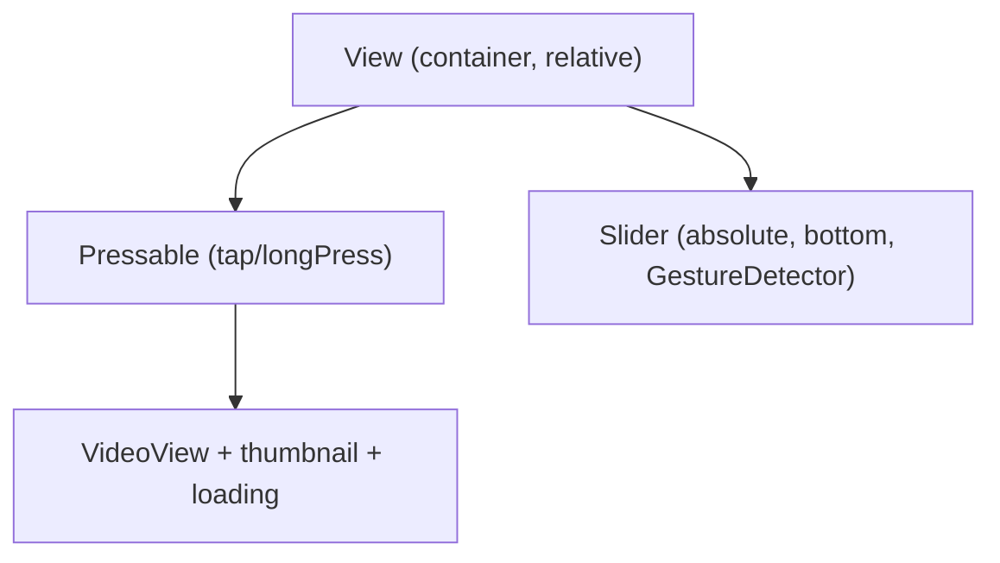

# Video Progress Slider for PostMedia

## Architecture

The slider will be a custom component rendered as a sibling **after** the video `Pressable` inside the container `View`, positioned absolutely at the bottom of the video. This prevents touch conflicts -- touches on the slider won't propagate to the `Pressable` (which handles tap-to-like, long-press-to-pause, etc.).

## Visibility / Auto-Hide Logic

- **Single tap on video** toggles `sliderVisible` state (on/off).
- When slider becomes **visible**: start a 1-second timer to auto-hide.
- When slider is **being dragged**: cancel the hide timer; slider stays visible.
- When drag **ends**: restart the 1-second hide timer.
- When slider is tapped **off**: hide immediately (no timer).
- Fade in/out via `withTiming` on a `sliderOpacity` shared value.

## Playback Position Tracking

Since `expo-video` has no `timeUpdate` event, poll `player.currentTime` and `player.duration` via `setInterval` (~250ms) while the slider is visible and the video is playing. Store progress as a reanimated shared value (`progress`, 0..1) for smooth UI updates. Skip polling while dragging.

## Slider Drag (Seeking)

Use `Gesture.Pan()` from `react-native-gesture-handler`:

- **onBegin**: set `isDragging` flag, cancel hide timer.
- **onUpdate**: compute new progress from `translationX` relative to slider width, update fill + thumb position, live-seek the video (`player.currentTime = newProgress * player.duration`).
- **onFinalize**: clear `isDragging`, final seek, restart 1-second hide timer.

Measure the slider track width via `onLayout` to map gesture translation to progress.

## UI Design

A thin semi-transparent track bar at the very bottom of the video, with:

- Background track: `rgba(255,255,255,0.3)`, height ~3px.
- Filled portion: `white`, width = `progress * trackWidth`.
- Thumb/knob: small white circle (12x12) at the current position.
- The entire bar container has some vertical padding for a larger hit area (~30px).

## Changes to [post-media.tsx](src/components/home/posts/post-media.tsx)

### New imports

- `Gesture`, `GestureDetector` from `react-native-gesture-handler`
- `runOnJS` from `react-native-reanimated` (for calling JS functions from worklets)

### New state / refs / shared values

- `sliderVisible` state (boolean)
- `sliderOpacity` shared value (0 or 1)
- `progress` shared value (0..1)
- `isDraggingRef` ref (boolean)
- `hideTimerRef` ref (for the 1-second auto-hide timeout)
- `sliderWidth` ref (from `onLayout`)

### Modified: `handleSingleTap`

Currently calls `showMuteIcon()`. Will additionally toggle `sliderVisible`:

- If slider is hidden -> show slider, start 1s hide timer.
- If slider is visible -> hide slider, cancel timer.

### New: Progress polling effect

A `useEffect` that sets up a 250ms `setInterval` when `sliderVisible && isPlaying && player && !isDragging`. Each tick reads `player.currentTime / player.duration` and writes to `progress` shared value.

### New: Slider JSX

Rendered only for `type === "video"`, positioned absolutely at the bottom of the video container, **after** the `Pressable` and heart overlay. Uses `GestureDetector` wrapping the track+thumb for pan gesture handling. Animated opacity controlled by `sliderOpacity`.

### New styles

- `sliderContainer`: absolute bottom, full width, padding for hit area
- `sliderTrack`: the background track bar
- `sliderFill`: the filled progress portion (animated width)
- `sliderThumb`: the draggable knob
